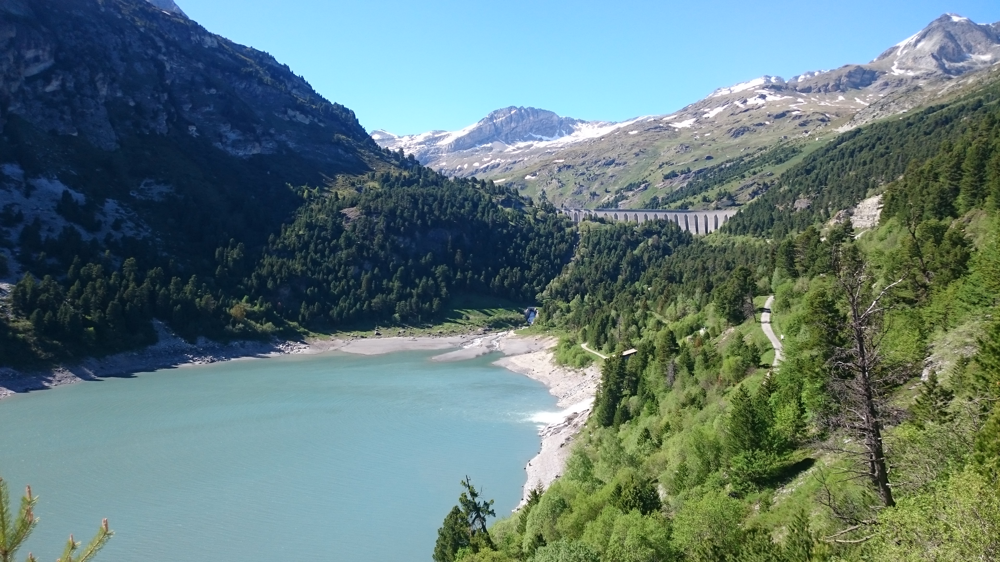

# mediation-challenge
Repository for the [Epigenetic and High-Dimension Mediation Data Challenge](https://data-institute.univ-grenoble-alpes.fr/events/epigenetic-high-dimension-mediation-data-challenge-710076.htm) (Aussois, June 7-9 2017)

## View points





##  1. Install software

### Install R and R-studio
To participate to the challenge, you need to install [R](https://cran.r-project.org/) on your computer. To make R easier to use, we suggest to install [RStudio](https://www.rstudio.com/), which is an integrated development environment (IDE) for R.

### Install R packages
To install R packages that are useful for the data challenge, copy and paste in R the following pieces of code

```r
#Install R packages for the Epigenetic & High-Dimension Mediation Data Challenge

#Package to read large table
install.packages("data.table")

#Package for controlling FDR and uses empirical null distribution
install.packages("fdrtool")

#Package to make an R developer's life easier
install.packages("devtools")
install.packages("tidyverse")

#Package to perform mediation analysis with multiple mediators
devtools::install_github("YinanZheng/HIMA")

#Package to compute Sobel test
install.packages("multilevel")

#Package q-value for controlling FDR
#Try https:// or http:// 
source("http://bioconductor.org/biocLite.R")
biocLite("qvalue")
biocLite("sva")

#Package for Confounder Adjusted Testing 
install.packages("cate")
```

##  2. Download datasets for challenges 1 and 2

Dataset for the 1st challenge and 2nd challenge can be loaded in R using the following pieces of code.

```r
require(data.table)
if (!file.exists("challenge1.txt"))
  download.file("https://goo.gl/iLFGeC",destfile="challenge1.txt")
data1<-fread("challenge1.txt",header=TRUE,data.table=FALSE)
```

```r
if (!file.exists("challenge2.txt"))
  download.file("https://goo.gl/OzDSRO",destfile="challenge2.txt")
data2<-read.table("challenge2.txt")
```

## 3. Form a team

A [tutorial](https://github.com/BioShock38/mediation-challenge/blob/master/submit.pdf) provides details about how to form a team and how to submit lists of markers.

To participate to the challenge, you should form teams. A team can be composed of 1, 2, or 3 participants. Once you have chosen a name for your team, send an email to [Florian Privé](mailto:florian.prive@univ-grenoble-alpes.fr) using "team mediation 2017" as email subject. A key for your team will then be sent to you by email.


## 4. Submit markers involved in mediation

The objective of the two data challenges is to find markers that are involved in the [mediation](https://en.wikipedia.org/wiki/Mediation_(statistics)) of a health outcome by a factor of exposure. For instance, you are asked to find, in the 2nd data challenge, the methylation markers that are involved in the mediation of skin cancer by sun exposure.

To submit a list of markers involved in mediation, you should use [the submission website](http://176.31.253.205/shiny/mediation-challenge/shiny-app/). An example of submission file containing a list of markers involved in mediation is contained in the file [mysubmission.txt](https://raw.githubusercontent.com/BioShock38/mediation-challenge/master/mysubmission.txt). 

## 5. Evaluation

The ranking of the participants will be based on the [F1 score](https://en.wikipedia.org/wiki/F1_score). The F1 score depends on the false discovery rate (FDR), which is the percentage of false positive markers in the submitted list, and of the power, which is the percentage of markers involved in mediation, which are found in the submitted list. The F1 score is equal to the harmonic mean of the power and of one minus the false discovery rate


## 6. Result vizualization

At the end of each challenge, send an email to [Florian Privé](mailto:florian.prive@univ-grenoble-alpes.fr) with a text file containing the list of P-values (one p-value per line).

```r
write(mypvalue,file="pval_nameofmyteam_challengenumber.txt")
```

A graphic showing your mediation analysis will be returned to you by mail.

## 7. Debriefing

At the end of each challenge, prepare 3 slides for debriefing, which contain Materials and Methods, Results and Discussion.


## 8. Miscellaneous

We provide some files to show examples of mediation analysis in R.

[Mediation analysis: Baron and Kenny procedure, Sobel test, and 2 data challenges](http://htmlpreview.github.io/?https://github.com/BioShock38/mediation-challenge/blob/master/Baron_Kenny_Sobel.html) 

[Mediation analysis and epigenome-wide association studies](https://github.com/BioShock38/mediation-challenge/blob/master/Aussois2017_Olivier_Francois.Rpres) 
